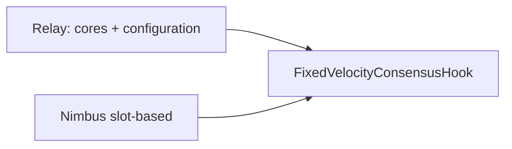

# Moonbase multi-core (elastic scaling) — implemented layout

This document describes **what is in the tree today**: Moonbase runtime constants aligned with the Polkadot SDK [enable_elastic_scaling](https://paritytech.github.io/polkadot-sdk/master/polkadot_sdk_docs/guides/enable_elastic_scaling/index.html) guide, local **Moonwall** relay patches, and the **Zombienet** Rococo harness used via `make start-zombienet-moonbase`.



## 1. Runtime (Moonbase) — fellowship-aligned constants

**File:** [`runtime/moonbase/src/lib.rs`](../runtime/moonbase/src/lib.rs)

Implemented:

- **`RELAY_PARENT_OFFSET: u32 = 1`** — public const; single source of truth for offset behind the relay parent.
- **`BLOCK_PROCESSING_VELOCITY: u32 = 3`** — must match **three relay cores** assigned to this para for elastic scaling.
- **`UNINCLUDED_SEGMENT_CAPACITY`** — SDK formula  
  `(2 + RELAY_PARENT_OFFSET) * BLOCK_PROCESSING_VELOCITY + 1` → **10** for offset `1` and velocity `3`.
- **`cumulus_pallet_parachain_system::RelayParentOffset = ConstU32<{ RELAY_PARENT_OFFSET }>`** — matches `RelayParentOffsetApi` in [`runtime/common/src/apis.rs`](../runtime/common/src/apis.rs).
- **`FixedVelocityConsensusHook`** wired with the above velocity and unincluded capacity (same file, `ConsensusHook` type alias + `Config` impl).

**Still intentionally unchanged (minimal first step):** `MILLISECS_PER_BLOCK = 6_000` and related staking / async-backing “expected block time” wiring — no fellowship-style 6s→2s para slot compression in this change set. See the SDK note in the elastic scaling guide if you later align wall-clock block time with `RELAY_CHAIN_SLOT_DURATION_MILLIS / BLOCK_PROCESSING_VELOCITY`.

**Runtime version:** `spec_version` includes the multi-core bump (see `spec_version` in the same `lib.rs`).

**Tests:** [`runtime/moonbase/tests/common/mod.rs`](../runtime/moonbase/tests/common/mod.rs) builds parachain inherent data with **`into_state_root_proof_and_descendants(RELAY_PARENT_OFFSET as u64)`** and supplies real **`relay_parent_descendants`** so `cumulus_pallet_parachain_system` accepts the proof when `RelayParentOffset` is non-zero.

```bash
cargo test -p moonbase-runtime --test integration_test
```

## 2. Relay configuration (N = 3)

Elastic scaling needs:

- **Three cores** for Moonbase’s `ParaId` on the relay (via broker / `coretime` on Rococo-style devnets).
- Relay **`configuration`** host parameters compatible with velocity **3** (`async_backing_params`, scheduler lookahead / core count consistent with your validator set).

### 2a. Moonwall (`localZombie`)

**File:** [`test/configs/localZombie.json`](../test/configs/localZombie.json)

- Relay **`rococo-local`**, para **`id: 1000`**, `moonbase-local`.
- Genesis patch under `relaychain.genesis.runtimeGenesis.patch.configuration.config`: **`async_backing_params`** (`max_candidate_depth: 3`, `allowed_ancestry_len: 2`) and **`scheduler_params.scheduling_lookahead`** (Moonwall JSON shape) tuned for local multi-core experiments alongside Moonwall’s provider.

Other Moonwall zombie JSONs (e.g. alphanet / moonbeam) were aligned the same way where applicable; Moonbase-focused work is **`localZombie.json`**.

### 2b. Zombienet (Rococo relay + one collator)

**Config:** [`zombienet/configs/moonbase-rococo.toml`](../zombienet/configs/moonbase-rococo.toml)  
**Spawn:** from repo root, after `make` / `all` (symlink + binaries as for other zombienet targets):

```bash
make start-zombienet-moonbase
```

This runs `zombienet spawn zombienet/configs/moonbase-rococo.toml` (see [`Makefile`](../Makefile) target `start-zombienet-moonbase`).

**Relay**

- **`chain = "rococo-local"`** — plain devnet from the pinned `polkadot` binary (`POLKADOT_VERSION` in the Makefile).
- **Genesis patch** (must live under **`[relaychain.genesis.runtimeGenesis.patch...]`** so Zombienet’s merger touches the chain-spec `genesis.runtimeGenesis.patch`, not a stray top-level key):
  - **`scheduler_params`:** `lookahead = 4`, **`num_cores = 3`**, `max_validators_per_core = 1`
  - **`async_backing_params`:** `max_candidate_depth = 3`, `allowed_ancestry_len = 2`
- **Three relay validators** (`alice`, `bob`, `charlie`): with `num_cores = 3` and `max_validators_per_core = 1`, each core has a validator group. If `num_cores` is much larger than the validator count, collators see **`no validators assigned to core`** and the para stops making progress on the relay.

**Parachain**

- **`id = 1000`**, **`chain = "moonbase-local"`**, `cumulus_based = true`.
- **`authorFilter`:** `eligibleCount = 1` (single eligible Nimbus author in genesis, same pattern as [`moonbeam-polkadot.toml`](../zombienet/configs/moonbeam-polkadot.toml)).
- **Collator `alith`:** `moonbeam` with `--pool-type=fork-aware`, **`--authoring=slot-based`**. Per-block authoring duration uses the CLI default (**2000 ms**); the cap allows up to **6000 ms** if you need heavier blocks per slot (see [`node/cli/src/cli.rs`](../node/cli/src/cli.rs) `block_authoring_duration_parser`).

**RPC ports:** Alice relay RPC defaults to **`9900`** in this config; collator RPC is set in the TOML (`rpc_port` on `[[parachains.collators]]`).

### 2c. Assign three cores after spawn (Polkadot.js Apps)

Genesis does **not** pre-assign broker cores for para `1000` in this harness; after the network is up, assign **cores `0`, `1`, and `2`** to **`ParaId` 1000** once (same as production-style `coretime` usage).

1. Open [Polkadot.js Apps](https://polkadot.js.org/apps).
2. Connect to the **relay** WebSocket (e.g. **`ws://127.0.0.1:9900`** for Alice in the default layout).
3. Use a mode that loads this chain’s metadata (**Development** / custom spec, or “Allow use on any chain”).
4. **Developer → Extrinsics** — submit as **`Alice`**:
   - **`sudo`** → **`sudo`**
   - Inner call: **`utility`** → **`batch`**
   - Add **three** calls: **`coretime`** → **`assignCore`** for **`core`** = **`0`**, **`1`**, **`2`** respectively.
5. For **each** `assignCore` (field names from **Developer → Runtime metadata** → `coretime` → `assignCore` if yours differ):
   - **`begin`:** **`0`**
   - **`assignments`:** `Vec<(CoreAssignment, PartsOf57600)>` of length **1**: variant **`Task`** with **`1000`**, parts **`57600`**
   - **Last `Option`:** **`None`**
6. Submit and wait until the batch is **in block** / finalized.

If nested types are awkward in Extrinsics, use **Developer → JavaScript** and build `api.tx.sudo.sudo(api.tx.utility.batch([...]))` from metadata.

**Sanity check:** collator logs should **not** keep printing `parachain::collator-protocol` **`there are no validators assigned to core`** after the batch succeeds; parachain best head should follow relay inclusion.

## 3. Collator / CLI knobs

**Files:** [`node/service/src/lib.rs`](../node/service/src/lib.rs), [`node/cli/src/cli.rs`](../node/cli/src/cli.rs)

- **`--authoring`:** `Lookahead` (default) vs **`slot-based`** — Zombienet Moonbase uses **`slot-based`** for multi-block-per-slot behaviour with elastic scaling.

## 4. Verification and maintenance

- **Runtime:** `cargo test -p moonbase-runtime --test integration_test` (inherent / offset regressions).
- **Local network:** `make start-zombienet-moonbase` → §2c → watch relay + para heads and collator logs.
- **Moonwall:** existing YAML/JSON flows using `localZombie.json` remain the other local path; keep scheduler / async-backing patches in sync when bumping SDK or fellowship recipes.
- **Benchmarks:** re-run `cumulus_pallet_parachain_system` / async-backing weights if behaviour or limits change materially.

## 5. Reference checklist (fellowship / SDK)

- [Elastic scaling guide](https://paritytech.github.io/polkadot-sdk/master/polkadot_sdk_docs/guides/enable_elastic_scaling/index.html): `RELAY_PARENT_OFFSET`, `BLOCK_PROCESSING_VELOCITY`, `UNINCLUDED_SEGMENT_CAPACITY`, `RelayParentOffsetApi`.
- [RFC 103 (core index commitment)](https://github.com/polkadot-fellows/RFCs/blob/main/text/0103-introduce-core-index-commitment.md) — ensure shipped node/runtime include behaviour your SDK expects.
- [polkadot-fellows/runtimes](https://github.com/polkadot-fellows/runtimes) — numerical relationships for system parachains (Moonbase uses **Nimbus**, not Aura).

---

**Success criteria (met by this doc’s scope):** relay exposes **three backed cores** and compatible **`configuration`**; Moonbase runtime uses **velocity 3**, **offset 1**, and matching **`RelayParentOffset`**; Zombienet + Polkadot.js reproduces the harness locally; **6s** para block time remains unless a follow-up changes staking / async-backing timing together.
